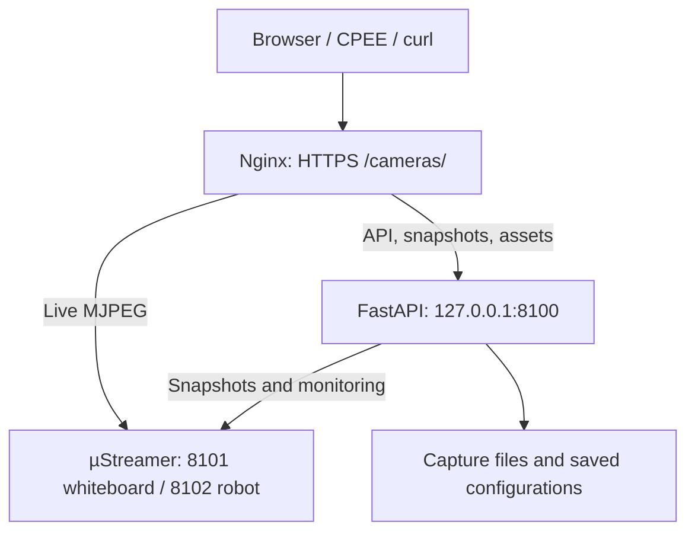

# Camera service

Documentation reviewed against the packaged source on **2026-09-28**.

Camera gateway for the BPM lab at TU München: current JPEG snapshots, saved
captures, live MJPEG video, camera settings and request activity for the
**whiteboard** and **robot** Logitech StreamCams.

See [PERFORMANCE_UPDATE.md](PERFORMANCE_UPDATE.md) for the performance changes,
focused regression checks, and deployment notes included in this ZIP.

## Dashboard

Open [the dashboard](https://lab.bpm.in.tum.de/cameras/dashboard).
Navigation order: **Stream · Snapshots · History · Docs · API Console · API CALLS**.
Settings is an icon-only entry beside the light/dark theme toggle.

| Page | URL hash | What it provides |
| --- | --- | --- |
| Stream | `#stream` | Live previews, reported capture-to-send latency, observed FPS and resolution |
| Snapshots | `#snapshots` | Automatically refreshed JPEG previews, browser request timings, save-snapshot buttons |
| History | `#history` | Saved capture lists, download/copy links, JPEG/JSON storage totals and last successful cleanup |
| Docs | `#docs` | Embedded snapshot/capture integration guide |
| API Console | `#api-console` | Execute selected finite requests and copy their URLs, curl commands and responses |
| API CALLS | `#api-calls` | Operator-protected recent API requests; 500 retained in memory, 25/50/100 displayed |
| Settings | `#settings` | Live previews, image controls, saved configurations, one-step undo |

Snapshot measurements continue across all dashboard panels, including when the
browser tab is hidden (browser background timer throttling may apply). Live
stream previews pause when their panel or browser tab is hidden. Server-side
stream history continues collecting independently.

`#api` remains a compatibility alias for API Console. The Docs tab is different
from FastAPI's generated `/docs` and `/redoc` pages.

## Architecture



Each µStreamer process owns one camera. The supplied Nginx location snippet
routes the public streams directly to µStreamer with buffering disabled. Other
requests reach FastAPI. TLS and any website authentication belong to the
surrounding Nginx server configuration; the snippet does not create them.
Image data travels to whichever client requests it, including CPEE if CPEE
retrieves a JPEG.

## Documentation map

| Document | Scope |
| --- | --- |
| [USAGE.md](USAGE.md) | Capture examples, timestamps, measurement meanings and dashboard links |
| [SERVER_LAYOUT.md](SERVER_LAYOUT.md) | Source modules, installed files, storage and request paths |
| [LAB_COMMANDS.md](LAB_COMMANDS.md) | SSH diagnosis and operational commands, in German |
| [CAMERA_CONTROLS.md](CAMERA_CONTROLS.md) | Operator key, image controls, saved configurations and undo |
| [API_CONSOLE.md](API_CONSOLE.md) | Interactive request console and its supported operations |
| [API_CALLS.md](API_CALLS.md) | Recent activity, exclusions, authorization and incremental retrieval |
| [TESTDOCUMENTATION.md](TESTDOCUMENTATION.md) | Current automated suites and lab checks |
| [ROADMAP.md](ROADMAP.md) | Implemented features, historical milestones and remaining validation |
| [CHANGELOG.md](CHANGELOG.md) | Change history, with historical observations identified |

## API endpoints

Paths below are relative to `http://127.0.0.1:8100` locally or
`https://lab.bpm.in.tum.de/cameras` publicly. `{camera_id}` is `whiteboard` or
`robot`; `{stem}` is a saved filename without its extension. “Key” means the
`X-Camera-Control-Key` header; website authentication can additionally apply to
any public request.

| Method | Path | Purpose | Key |
| --- | --- | --- | --- |
| GET | `/healthz` | API process responds | No |
| GET | `/readyz` | Per-camera availability check; 200 if all pass, otherwise 503 | No |
| GET | `/api/v1/cameras` | Camera IDs, availability and API-relative URLs | No |
| GET | `/api/v1/cameras/{camera_id}/snapshot.jpg` | Current JPEG, not saved | No |
| GET | `/api/v1/cameras/{camera_id}/stream.mjpeg` | Live MJPEG; public route normally bypasses FastAPI | No |
| POST | `/api/v1/cameras/{camera_id}/captures` | Save one JPEG/JSON pair; empty request body | No |
| GET | `/api/v1/captures` | Latest complete capture pairs; `limit=1..50`, default 10 | No |
| GET | `/api/v1/captures/stats` | Top-level JPG/JSON bytes and last successful cleanup | No |
| GET | `/api/v1/captures/{stem}.jpg` | Saved JPEG from a complete pair | No |
| GET | `/api/v1/captures/{stem}.json` | Saved metadata from a complete pair | No |
| GET | `/api/v1/status` | API uptime, availability and live target capture mode | No |
| GET | `/api/v1/stream-metrics` | In-memory stream-state and latency history | No |
| GET | `/api/v1/activity` | Recent recorded API calls | Yes |
| GET | `/api/v1/cameras/{camera_id}/controls` | Supported image controls and current values | No |
| GET | `/api/v1/cameras/{camera_id}/controls/access` | Check the shared operator key | Yes |
| PATCH | `/api/v1/cameras/{camera_id}/controls` | Apply native integer image-control values | Yes |
| POST | `/api/v1/cameras/{camera_id}/controls/reset` | Restore eligible driver-reported image-control defaults | Yes |
| GET | `/api/v1/cameras/{camera_id}/controls/configs` | List saved configurations | Yes |
| POST | `/api/v1/cameras/{camera_id}/controls/configs` | Save current image settings under a name | Yes |
| POST | `/api/v1/cameras/{camera_id}/controls/configs/{config_id}/load` | Apply saved image settings | Yes |
| POST | `/api/v1/cameras/{camera_id}/controls/undo` | Restore the state before the preceding change using its undo token | Yes |
| GET | `/openapi.json` | Current machine-readable API specification | No |
| GET | `/docs` | Generated Swagger UI | No |
| GET | `/redoc` | Generated ReDoc UI | No |
| GET | `/dashboard` | Dashboard HTML | No |
| GET | `/dashboard/assets/{path}` | Static dashboard assets | No |

FastAPI also provides `/docs/oauth2-redirect` for its Swagger UI; it is a
framework helper, not an implemented operator OAuth login. Generated docs work
locally. The supplied proxy strips `/cameras` and the API unit does not set a
`root_path`, so generated docs may request the schema at the wrong public root.
Use `/cameras/openapi.json` directly or API Console's **Get API specification**
until that proxy-prefix integration is configured.

Availability currently means that µStreamer's `/?action=ping` returns HTTP 200.
It does not decode a frame or establish its freshness. Mock sources always
report available. Use a real snapshot and stream metrics when verifying image
delivery. The direct FastAPI stream fallback polls snapshots at a default
10 FPS (`fps` is clamped to 1–30); it is distinct from the public direct stream.

## Snapshot and storage behavior

```bash
# Current JPEG, downloaded to this client; nothing saved by the API:
curl -fsS 'https://lab.bpm.in.tum.de/cameras/api/v1/cameras/whiteboard/snapshot.jpg' -o whiteboard.jpg

# Save one capture; response body and Location contain its full JPEG URL:
curl -fsS -X POST 'https://lab.bpm.in.tum.de/cameras/api/v1/cameras/whiteboard/captures'
```

Use `robot` in place of `whiteboard` for the other camera. These endpoints fetch
a frame from the running source; they do not trigger a synchronized sensor
exposure or guarantee a different frame on every rapid request. Supply any
required website credentials separately from the operator key.

Saved files are flat pairs named `<camera>_YYYYMMDDTHHMMSSmmmZ.jpg` and `.json`.
`Z` is UTC; timestamps are assigned after the API receives and inspects the
JPEG, not at exposure. Collisions use the next free millisecond for the filename.
Metadata `captured_at` retains the receive timestamp. POST rejects a nonempty
body with 400. Successful saves return 201 and a plain-text URL, not JSON.

Pairs and recognized orphan JPEGs become eligible for deletion after 48 hours,
based on the filename timestamp. Cleanup runs at API startup and hourly. With a
healthy running service, removal is normally at the next hourly cleanup; downtime
or errors can delay it further. Retrieval is not blocked solely because a file
has expired. Subdirectories, symlinks and unrecognized filenames are not managed
by retention. Statistics count top-level nonsymlink `.jpg`/`.json` files even
when they are not valid complete captures. Saved configurations are separate and
are not subject to capture retention.

## Local development

Run from the `CameraMonitoring` directory. The project declares Python >=3.11;
Python 3.12 is a practical choice for its pinned dependencies. Create a local
virtual environment rather than copying the ZIP's environment between machines.
No JavaScript build step is required; Node is used for tests.

```bash
python3.12 -m venv .venv
source .venv/bin/activate
python -m pip install -r requirements.txt

# Create this optional local file; it is not supplied in this ZIP.
cat > config/development.yaml <<'YAML'
cameras:
  whiteboard:
    source: mock
  robot:
    source: mock
storage:
  captures_dir: var/captures
YAML

export CAMERA_SERVICE_CONFIG=config/development.yaml
python -m uvicorn api.main:app --reload --host 127.0.0.1 --port 8100
```

Open [the local dashboard](http://127.0.0.1:8100/dashboard). Mock images are
generated when no image path is supplied; bundled JPEG fixtures are not needed.
Physical-camera controls are unavailable for mock sources. To inspect API Calls
locally, set a nonempty `CAMERA_SERVICE_CONTROLS_TOKEN` before starting the API.

The loader uses `CAMERA_SERVICE_CONFIG` to select a YAML file; a missing file
silently uses model defaults, including mock cameras. Always verify the selected
path in production. Arbitrary `CAMERA_SERVICE_*` variables do not override YAML
fields; the operator token is read separately by the controls service.

## Production configuration and initial deployment

The supplied unit runs as `lab`, from `/home/lab/camera-service`, with one worker.
The following setup assumes that installation path and existing lab Nginx server.

1. Install µStreamer and `v4l-utils` on the server (Fedora: `sudo dnf install
   ustreamer v4l-utils`). Give `lab` access to the `video` group; a new login is
   needed for interactive shells. The API unit also requests that group.
2. Copy the source and install requirements in a server-local virtual environment.
3. For a **new installation**, copy `config/production.example.yaml` to
   `config/production.yaml`. For an existing installation, preserve the active
   file and merge only deliberate changes.
4. Replace both device placeholders and check ports against the capture services.
   The supplied hardware output identifies whiteboard `51EF0655` on port 8101,
   and robot `DA702655` on port 8102. The template's 1280×720/30 FPS is an example,
   not a readback of the cameras' present mode.
5. Set `api.public_base_url: "https://lab.bpm.in.tum.de/cameras"` in the YAML.
   The template currently omits this setting. Without it, returned capture URLs
   use the request base and may omit the public `/cameras` prefix.
6. Choose storage deliberately. The model default is `var/captures`; the production
   template uses `/var/lib/camera-service/captures`. A relative path resolves under
   the unit's working directory. The API user must be able to create/write that
   directory and the sibling `camera-configs` directory, or the explicit
   `storage.camera_configs_dir` if set.

For the production template's storage path, create writable directories once:

```bash
sudo install -d -o lab -g lab -m 0750 /var/lib/camera-service/captures /var/lib/camera-service/camera-configs
```

Create `/etc/camera-service/whiteboard.env` and `robot.env` for a new installation.
Preserve existing files during updates. Example contents:

```text
# whiteboard.env
DEVICE=/dev/v4l/by-id/usb-046d_Logitech_StreamCam_51EF0655-video-index0
PORT=8101
RESOLUTION=1280x720
FPS=30
```

```text
# robot.env
DEVICE=/dev/v4l/by-id/usb-046d_Logitech_StreamCam_DA702655-video-index0
PORT=8102
RESOLUTION=1280x720
FPS=30
```

The YAML does not launch or reconfigure µStreamer. Its device/port mapping must
match these files. Resolution/FPS changes are managed only in the server capture
configuration. Both Python adapters currently connect to `127.0.0.1`;
changing `ustreamer.host` in YAML does not redirect them. Uvicorn's listen address
and port are also set by the launch command/unit, not by the YAML `api.host/port`.

Install and enable services on a new installation:

```bash
cd /home/lab/camera-service
sudo cp deployment/systemd/*.service /etc/systemd/system/
sudo systemctl daemon-reload
sudo systemctl enable --now camera-capture@whiteboard.service camera-capture@robot.service camera-api.service
sudo cp deployment/nginx/camera-api.conf /etc/nginx/cpee.d/locations.d/camera
sudo nginx -t
sudo systemctl reload nginx
```

Enable image controls using [CAMERA_CONTROLS.md](CAMERA_CONTROLS.md). Resolution/FPS
selection and its privileged restart helper have been removed. Existing installations
should follow [REMOVAL_NOTES.md](REMOVAL_NOTES.md) to remove the old server files.
The current authentication model is a **single shared
operator key**, not individual accounts or revocable personal keys.

## Updating an existing installation

Example from your local machine, with the `lab` SSH alias configured:

```bash
rsync -av \
  --exclude='.git/' --exclude='.venv/' --exclude='var/' \
  --exclude='__pycache__/' --exclude='.pytest_cache/' --exclude='test-captures/' \
  --exclude='config/production.yaml' \
  ~/CameraMonitoring/ lab:~/camera-service/
```

The ZIP's `JavaScript-text/` folder contains matching `.js.text` copies for manual
transfer. The executable files belong in `dashboard/assets/`; do not serve the
`.text` copies instead. Do not overwrite active settings, saved files or the
server virtual environment from an archive.

| Changed files | Follow-up |
| --- | --- |
| Markdown only | No service restart or browser refresh required |
| `dashboard/` only | Hard-refresh the browser |
| `api/` or active production YAML | Restart `camera-api.service` |
| Python requirements | Install requirements in the server venv, then restart the API |
| Base systemd units | Copy them, daemon-reload, restart affected units |
| Camera base `.env` | Restart only that camera's capture unit; expect an interruption |
| Nginx location snippet | Copy/merge, run `nginx -t`, then reload Nginx |

```bash
sudo systemctl restart camera-api.service
sudo systemctl status camera-api.service --no-pager
curl -fsS http://127.0.0.1:8100/healthz
```

Restarting the API clears request history, stream metric history and undo state.
It does not delete saved configurations or unexpired captures; startup cleanup
can remove expired captures. Existing direct Nginx/µStreamer streams do not
require an API connection.
