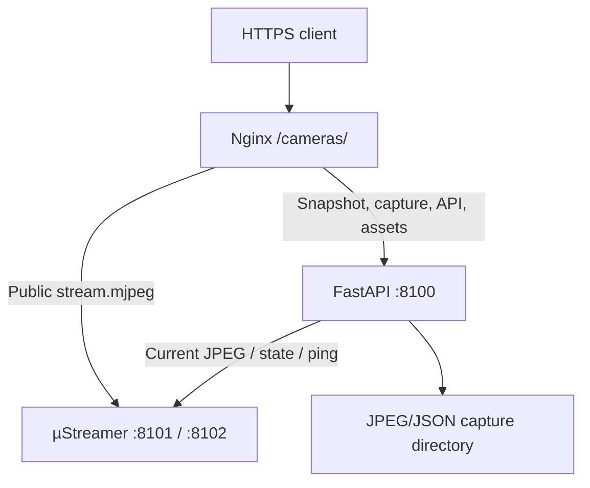

# Server layout

Documentation reviewed against the packaged source on **2026-09-28**.
Paths describe the supplied deployment and previously reported lab installation;
use the active configuration to determine current storage and capture modes.

## Application files: `/home/lab/camera-service/`

| Path | Purpose |
| --- | --- |
| `api/main.py` | App lifecycle, core camera/capture/monitoring routes, static mounting and router registration |
| `api/cameras.py` | Mock JPEGs and HTTP adapter for local µStreamer instances |
| `api/captures.py` | Flat JPEG/JSON storage, metadata, listing, statistics and retention |
| `api/settings.py` | Loads the YAML selected by `CAMERA_SERVICE_CONFIG` into typed models |
| `api/controls.py` | Operator-key authorization, V4L2 image controls, saved-config routes and in-memory undo |
| `api/camera_configs.py` | Persistent named image configurations |
| `api/capture_modes.py` | MJPEG mode discovery, helper invocation and image-setting restoration |
| `api/stream_metrics.py` | Persistent header-only collector, five-second aggregation and in-memory history |
| `api/activity.py` | Bounded API-call recorder and protected incremental activity endpoint |
| `dashboard/index.html` | All dashboard page panels and navigation |
| `dashboard/assets/app.js` | Hash navigation, uptime, polling and page lifecycle |
| `dashboard/assets/stream.js`, `snapshots.js`, `charts.js` | Image views and timing charts |
| `dashboard/assets/history.js` | Capture lists, downloads, copy links and storage summary |
| `dashboard/assets/settings.js`, `controls.js`, `capture-mode.js` | Camera settings, operator access, dialogs and staged mode changes |
| `dashboard/assets/api-console.js`, `api-calls.js` | Request console and recent-call table |
| `dashboard/assets/common.js`, `theme.js`, `syntax-highlight.js` | Shared functions, theme selection and code formatting |
| `dashboard/assets/styles.css`, `fonts/`, `icons/` | Responsive layout and self-hosted visual assets |
| `config/production.example.yaml` | Production template; placeholders require editing |
| `config/production.yaml` | Installation-specific active YAML; preserve during updates |
| `requirements.txt`, `pyproject.toml` | Pinned installation dependencies and project/test settings |
| `.venv/` | Server-local Python environment; do not synchronize between machines |
| `tests/` | Current backend and JavaScript suites; see [TESTDOCUMENTATION.md](TESTDOCUMENTATION.md) |

`config/development.yaml` is optional and is not included in this ZIP. The README
shows how to create it. Without a selected YAML file, model defaults use mocks.
The ZIP's separate `JavaScript-text/` directory contains text copies of JS assets;
it is not part of the HTTP application.

## System services and configuration

| Installed path | Purpose |
| --- | --- |
| `/etc/systemd/system/camera-api.service` | Uvicorn at `127.0.0.1:8100`, one worker, user/group `lab`, supplementary `video` group |
| `/etc/systemd/system/camera-capture@.service` | µStreamer instances on ports 8101 and 8102, user `lab`, group `video` |
| `/etc/camera-service/whiteboard.env` | Whiteboard `DEVICE`, `PORT`, base `RESOLUTION` and `FPS` |
| `/etc/camera-service/robot.env` | Robot equivalent |
| `/etc/camera-service/controls.env` | Shared `CAMERA_SERVICE_CONTROLS_TOKEN`, read at API startup |
| `/etc/systemd/system/camera-api.service.d/controls.conf` | Drop-in installed by `deployment/setup-controls.sh` |
| `/etc/camera-service/capture-mode-policy.json` | Root-owned camera/device/port policy installed by capture-mode setup |
| `/usr/local/libexec/camera-capture-mode` | Installed standalone helper for one-camera mode transactions |
| `/etc/sudoers.d/camera-capture-mode` | Allows the API user to invoke only the fixed-purpose helper |
| `/etc/camera-service/capture-modes/whiteboard.env` and `robot.env` | Optional persistent resolution/FPS overrides |
| `/etc/systemd/system/camera-capture@whiteboard.service.d/90-capture-mode.conf` and robot equivalent | Loads each override after its base `.env` |
| `/run/camera-service-mode/` | Per-camera helper locks; runtime files |
| `/etc/nginx/cpee.d/locations.d/camera` | Installed routing snippet; surrounding server owns TLS and website access |

The API unit uses `After`/`Wants` for the capture services; it does not require
both cameras to be healthy before serving requests. Each service uses
`Restart=on-failure`, subject to systemd start limits. Inspect effective units
with `systemctl cat`, which includes drop-ins; reading only the base file can
miss active settings.

The reported camera mapping is whiteboard serial `51EF0655`, port 8101, and
robot serial `DA702655`, port 8102. USB bus paths can change when cabling changes.
The latest supplied driver output reported **1920×1080 MJPEG at 30 FPS** on both
cameras; this is a dated readback, not a fixed deployment requirement. Base
examples still use 1280×720/30. Read `/state` and active overrides for current mode.

## Persistent and temporary state

| State | Location / lifetime |
| --- | --- |
| Saved captures | `storage.captures_dir`; flat JPEG/JSON pairs; 48-hour retention |
| Named image configurations | `storage.camera_configs_dir`, or `camera-configs` beside captures; no capture retention |
| Capture-mode overrides | Root-owned `.env` overrides; survive reboot |
| Undo state and per-camera locks | API process memory; cleared at restart |
| Stream metric history | Up to 360 nonempty aggregation slots per camera; cleared at restart |
| Recent API calls | Latest 500 recorded requests; cleared at restart |
| Browser operator keys | In memory per access interface; cleared by lock/clear or reload/page exit |
| Theme preference | Browser local storage |

The model default `var/captures` resolves to
`/home/lab/camera-service/var/captures` under the supplied unit. The production
YAML template instead sets `/var/lib/camera-service/captures`. Either can be
valid; neither should be assumed without reading the active YAML. Ensure `lab`
can write the chosen capture and saved-configuration directories.

A saved pair is `<camera>_YYYYMMDDTHHMMSSmmmZ.jpg` plus `.json`. Metadata contains
`camera_id`, `captured_at`, `filename`, `size_bytes`, `width_px`, `height_px` and
`content_type`. Retention uses the filename time, runs at startup and hourly,
and ignores subdirectories/symlinks/unrecognized names. Expired files may remain
longer when the service is stopped or cleanup fails. Listing and retrieval
require a valid complete pair; statistics count all top-level nonsymlink JPG/JSON
bytes, including orphan files. See [USAGE.md](USAGE.md) for timestamp semantics.

## Request paths

- **Immediate snapshot:** Nginx strips `/cameras`, FastAPI requests
  `/?action=snapshot` from the selected local µStreamer and returns JPEG bytes.
  It adds a server receive/response timestamp; it does not measure sensor exposure.
- **Saved snapshot:** FastAPI fetches one JPEG, inspects its dimensions, writes a
  unique pair, and returns 201 with its full URL in plain text and `Location`.
  `api.public_base_url` supplies the external prefix.
- **Public live stream:** the supplied prefix location proxies to µStreamer
  `/?action=stream`. FastAPI is bypassed. Its separate fallback stream route is
  used on direct API access instead.
- **Settings:** ordinary image controls use asynchronous `v4l2-ctl` commands.
  Capture-mode writes additionally invoke the installed helper to restart one
  capture service and verify the resulting mode.
- **API CALLS:** the protected endpoint reads memory only. It cannot observe
  Nginx-rejected requests or direct µStreamer traffic.

There is no fixed expected latency for these paths. Browser response timing,
µStreamer frame latency and full camera-to-display latency measure different
intervals; see [USAGE.md](USAGE.md).
